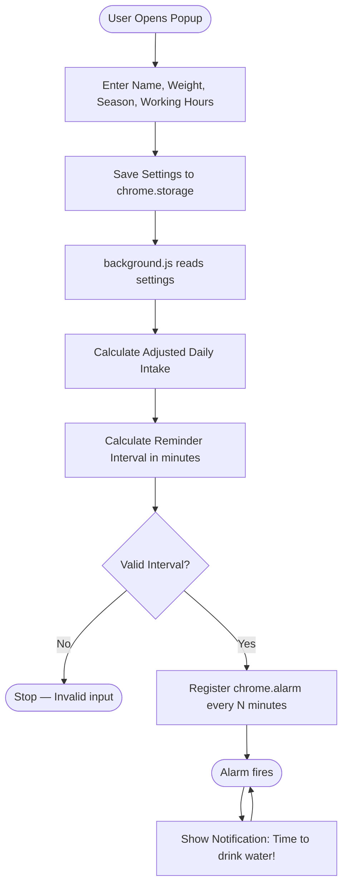
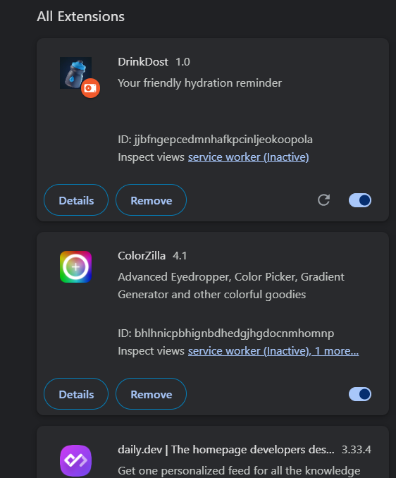
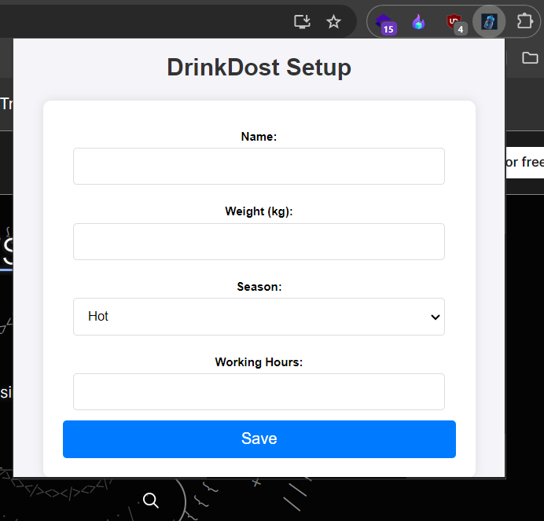
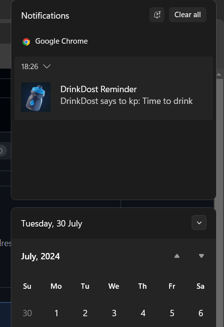

# DrinkDost Browser Extension

## Overview

**DrinkDost** is a browser extension designed to help you stay hydrated throughout your workday. It provides reminders to drink water based on your personal settings, including weight, season, and working hours.

## Features

- **Customizable Reminders**: Set your weight, working hours, and season to receive tailored water intake reminders.
- **Frequent Notifications**: Get periodic notifications to drink water based on your calculated intake.
- **End-of-Day Confirmation**: Receive a congratulatory message when you've met your daily water intake goal.

## How It Works

DrinkDost calculates how often to remind you based on your body weight, the season, and your working hours.

### 💧 Water Intake Formula

**Step 1 — Base daily intake:**

$$\text{Daily Intake (L)} = \text{Weight (kg)} \times 0.035$$

**Step 2 — Seasonal adjustment:**

| Season | Factor |
|--------|--------|
| Hot | +20% |
| Cold / Moderate | +0% |

$$\text{Adjusted Daily Intake (L)} = \text{Daily Intake} \times (1 + \text{Seasonal Factor})$$

**Step 3 — Reminder interval:**

Each reminder delivers approximately **62 ml** of water. The interval between reminders is:

$$\text{Interval (min)} = \frac{\text{Working Hours} \times 60 \times 62}{\text{Adjusted Daily Intake (L)} \times 1000}$$

### Flow Diagram

### Example Calculation

| Input | Value |
|---|---|
| Weight | 70 kg |
| Season | Hot |
| Working Hours | 8 hrs |

$$\text{Daily Intake} = 70 \times 0.035 = 2.45 \text{ L}$$

$$\text{Adjusted Intake} = 2.45 \times 1.20 = 2.94 \text{ L}$$

$$\text{Number of sips} = \frac{2940 \text{ ml}}{62 \text{ ml}} \approx 47 \text{ sips}$$

$$\text{Interval} = \frac{8 \times 60}{47} \approx \textbf{10.2 minutes}$$

So for a 70 kg person working 8 hours in summer, DrinkDost sends a reminder roughly **every 10 minutes**.

---

## Screenshots

### Extension Setup

### Data Entry

### Notifications

## Installation

1. **Download the Extension**

   Click the link below to download the extension file:
   - [Download DrinkDost Browser Extension (.crx)]([DrinkDost-BrowserExtension.crx](https://github.com/kashyapprajapat/DrinkDost/releases/tag/in))

2. **Install the Extension in Chrome**

   - Open Chrome and navigate to `chrome://extensions/`.
   - Enable “Developer mode” by toggling the switch in the top right corner.
   - Drag and drop the downloaded `.crx` file onto the `chrome://extensions/` page.
   - Confirm the installation in the popup that appears.

## Usage

1. **Setup Your Preferences**

   - After installation, click on the DrinkDost icon in the browser toolbar.
   - Enter your name, weight, season, and working hours in the setup form.
   - Save your preferences.

2. **Receive Notifications**

   - The extension will send you notifications to drink water according to your settings.
   - At the end of the day, you’ll receive a congratulatory message if you’ve met your water intake goal.

## Contributing

If you want to contribute to the development of DrinkDost, please fork the repository and submit a pull request.

---

**DrinkDost** helps you stay hydrated and productive. Thank you for using our extension!

